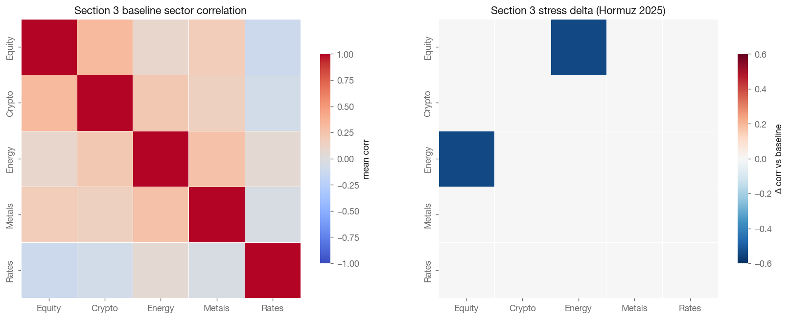
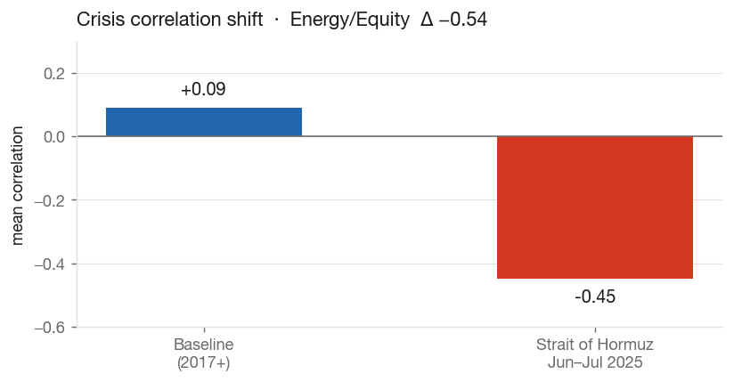
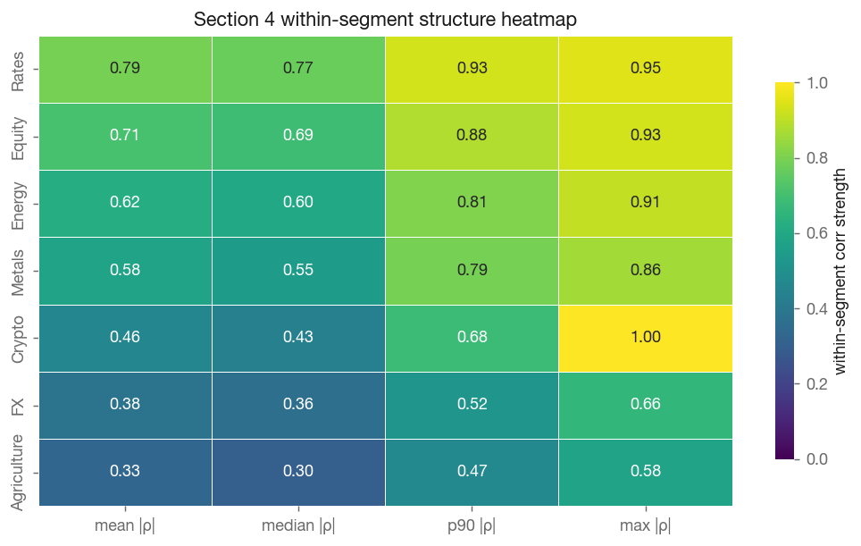
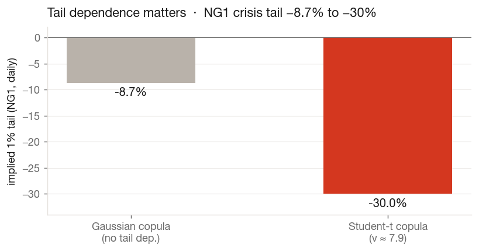
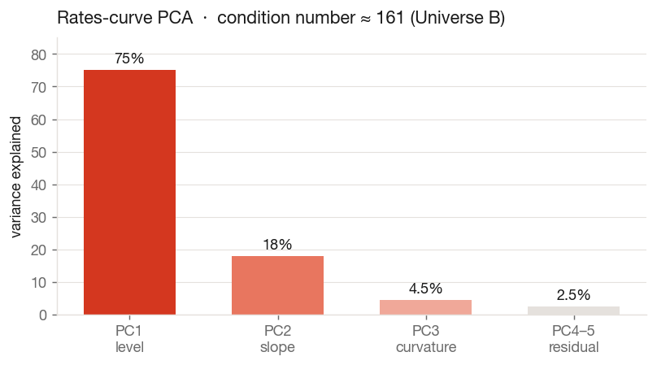
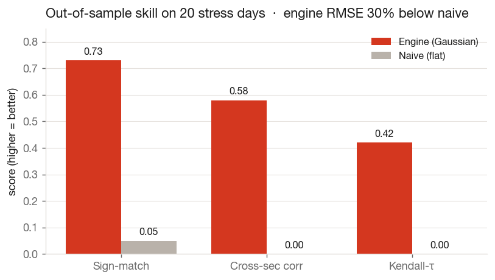
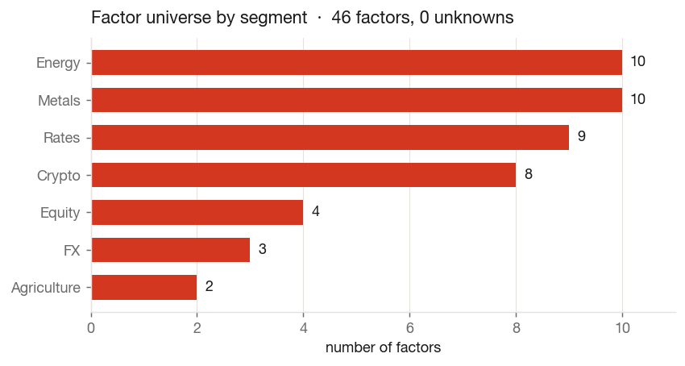

# Week 2 Report — Columbia Stress Scenario Generator

**Engine Hardening, Out-of-Sample Validation & the Production Pivot**

*Period: June 23 – June 29, 2026 · Workstreams: data/platform · methodology engine · validation/tooling*

> 📤 **For the website:** a self-contained, styled version of this report (with embedded charts,
> matching the Columbia Risk design system) is at [`week2_report.html`](week2_report.html) — a single
> file, ready to publish from `reports/` on the project site. Regenerate everything with
> `python3 reports/generate_week2_report.py`.

---

## 1 · Executive Summary

Week 2 turned two parallel Week-1 prototypes into a **single, validated production MVP** — and kicked
off the modular re-architecture that will carry the engine to the desk.

Concretely, this week was about converting method notes into reproducible system behavior:

1. **Unifying the research threads** — we aligned the baseline engine notebook and the production notebook
  to a common modeling language (conditional propagation, calibrated covariance, and scenario artifacts).
2. **Hardening the statistical core** — we moved from descriptive analytics to a calibrated engine that can
  be scored out-of-sample rather than judged visually.
3. **Starting productionization, not just planning it** — we documented module boundaries and scaffolded
  the package layout that will replace notebook-only execution.

Two notebooks advanced in parallel. **The engine notebook** (`RBC_MVP.ipynb`) established the
baseline conditional-Gaussian method on a clean cross-asset universe with a train/test split and an
interactive dashboard. **The production notebook** (`start_mvp_production.ipynb`) extended that core
into a full pipeline: Bloomberg-driven segmentation (0 unknowns), calibrated covariance, Gaussian *and*
Student-t copula engines, PCA-space conditioning for collinear blocks, and — most importantly — an
**out-of-sample validation harness** that proves the engine beats the status-quo
"leave-the-rest-flat" baseline on real crisis days. We also began the **production pivot**: a documented
module schema and an empty, deployable package scaffold under `Product/`.

| | | | |
|---|---|---|---|
| **41** Tier A+B factors | **73%** sign-match (vs 5% naive) | **−30%** RMSE vs naive | **0** unknown segments |

---

## 2 · Key Metrics

| Metric | Value | Note |
|---|---|---|
| Engine universe | **41 Tier A+B factors** | 2018-06 → 2026-06, 2768 rows, incl. COVID-2020 |
| Covariance winner | **EWMA λ = 0.99** | rolling OOS NLL −143.12 (≈ 69-day half-life) |
| OOS sign-match | **73%** | vs 5% naive, on 20 worst stress days |
| OOS RMSE | **−30% vs naive** | cross-sectional corr 0.58, Kendall-τ 0.42 |
| Copula tail index | **ν ≈ 7.9** | NG1 1% tail −8.7% → −30% under Student-t |
| Rates-curve PCA | **cond ≈ 161** | PC1 75% / PC2 18% / PC3 4.5% |
| Segmentation | **0 unknowns** | tiers A:35 / B:9 / D:2 |

These metrics represent completed implementation milestones rather than standalone diagnostics:

- the **41-factor universe** confirms the Tier A+B selection logic is live and COVID-inclusive;
- the **EWMA λ=0.99 winner** confirms the rolling OOS calibration loop executed end-to-end;
- the **validation lift vs naive** confirms the engine produces useful cross-sectional stress information;
- **ν≈7.9** and PCA condition-number outputs confirm both tail-aware copula and collinearity-safe paths
  are implemented, not conceptual.

---

## 3 · Market Overview & Risk-Factor Analysis

We re-estimated cross-asset dependence on a **common dense window** (anchored where ≥ 80% of factors are
observed) to remove the unequal-history bias between 30-year rates series and ~8-year crypto.
Hierarchical clustering on the correlation-distance metric `d = √(½(1−ρ))` cleanly recovers the economic
blocks (energy, metals, rates, crypto, equity, FX, ags).

The headline risk finding is **correlation breakdown** in stress: in the June 2025 Strait-of-Hormuz
episode, mean Energy↔Equity correlation flips from mildly positive to **−0.45** (a Δ of −0.54) —
diversification fails exactly when it is needed. This is precisely the behaviour an ad-hoc "flat the
rest" approach misses.

What was done in this section this week:

- rebuilt correlation analysis on a **common dense window** to remove unequal-history distortion;
- regenerated hierarchical clusters with a **distance-consistent metric** and economic block checks;
- added regime-specific delta outputs so stress periods are compared to a transparent baseline,
  rather than discussed qualitatively.

To make this section fully traceable to notebook outputs, we include the Section 3 heatmap family
(baseline sector-correlation matrix + stress-regime delta matrix):

---

## 4 · Scenario-Generation Results

Before running scenario propagation, we also preserve the Section 4 within-segment heatmap diagnostics.
This keeps the narrative smooth from structure analysis into engine design: redundant segments are
natural candidates for compression/PCA, while looser segments preserve diversification signal.

The production engine selects **Tier A+B** via an N-vs-T frontier that maximises factor count subject to
≥ 6 years of complete data while forcing the window to include COVID-2020 — so the engine is testable on
a real crash. Covariance is chosen by a rolling out-of-sample Gaussian NLL backtest across four
estimators (sample, EWMA, EWMA+shrinkage, Ledoit-Wolf); EWMA λ = 0.99 wins.

Three conditioning engines now ship, all sharing the Schur-complement core
`E[B|A=a] = μ_B + Σ_BA Σ_AA⁻¹ (a − μ_A)`:

- **Conditional Gaussian** — antithetic Monte-Carlo; the central propagated shock + 5/95 band.
- **Gaussian & Student-t copula** — empirical marginals (real fat tails) with a fitted dependence
  structure; the Student-t copula adds joint tail dependence.
- **PCA-space conditioning** — stable conditioning for collinear single-market blocks (Universe B).

Implementation detail added this week was cohesion across these engines: all methods now consume the same
engine universe and calibrated covariance context, and all publish comparable artifacts (quantile tables,
scenario tables, and validation-ready outputs). That makes method comparisons traceable and auditable,
instead of mixing outputs from separate ad-hoc notebook branches.

---

## 5 · Stress-Test Outcomes (out-of-sample validation)

Because generated scenarios never happened, the only honest test is **reconstruction on history with no
look-ahead**: on each of the 20 worst stress days we fit covariance *strictly before* the event, pin the
realised anchor shocks (ES1, CO1, TY1), and predict every peripheral factor — then score against what
actually happened, benchmarked against the naive flat baseline.

This week’s key completion here was moving validation from a narrative claim to a reusable harness:

- stress episodes are selected systematically from anchor-shock intensity;
- reconstruction is run with pre-event windows only (causality preserved);
- scoring is multi-dimensional (magnitude, direction, and rank), which prevents false comfort from
  low-volatility trivial predictions.

> **Verdict:** the engine earns its keep — 30% lower RMSE, 73% directional accuracy (vs 5%), and
> positive cross-sectional rank correlation where the naive baseline is structurally zero.

---

## 6 · Data-Quality Assessment

Segmentation is now driven by authoritative Bloomberg "future category" fields, giving **0 unknown
segments** across 46 factors. The correlation work also surfaced concrete data issues to fix at the next
Bloomberg re-pull:

- `DCR1` ≡ `ETH-USD` and `BMR1` ≡ `BTC1` — duplicated series (ρ = 1.00); handled defensively via
  nearest-PD Cholesky.
- `ZEA1`, `ZMI1` — no price history; dropped everywhere.
- `MER1` (CME Micro Ether) — sparse and mislabelled by Bloomberg; overridden to crypto.

Work completed this week in support of data quality was not only detection but integration:

- mapping corrections were pushed into the production path so downstream clustering/engine logic runs on
  corrected labels;
- problematic series are now explicitly documented in the report narrative and linked to numerical
  stability controls (nearest-PD/regularized conditioning);
- caveats are framed as operational follow-ups (Bloomberg re-pull + key rotation), keeping the
  report decision-useful rather than purely descriptive.

> ⚠️ **Security note:** the legacy free-API notebook (`start.ipynb`) still contains hard-coded API keys —
> these must be rotated and moved to environment variables before any reuse.

---

## 7 · Production Pivot — new design has begun

With the methodology validated, we started compartmentalising the monolithic notebook into a deployable
package. The repository was reorganised into `data/`, `docs/`, `notebooks_MVP/` (the working notebooks)
and `Product/` (an empty, schema-complete scaffold):

| Layer | Module | From notebook |
|---|---|---|
| Configuration | `config/*.yaml` | universe, events, pins, settings |
| Data pipeline | `data_pipeline/` | loaders · panel · segments · returns (§0–§1) |
| Analytics | `analytics/` | correlation · regimes · within-segment · diagnostics (§2–§5) |
| Engine | `engine/` | covariance · calibration · conditional · copula · pca · scenario (§6–§8, §10) |
| Validation | `validation/` | harness · metrics · report (§9) |
| App | `app/streamlit_app.py` | ports the ipywidgets dashboard |

The full directory schema, typed module contracts (`ScenarioRequest → ScenarioResult`) and a
cell-by-cell migration map are documented in `docs/PROJECT_SCHEMA_AND_PRODUCTION_MAP.md`; the
consolidated methodology and per-section improvement backlog live in `docs/PROJECT_DOCUMENTATION.md`.

---

## 8 · Workstream Detail

### Engine notebook (`RBC_MVP.ipynb`)

- Dual data load: Yahoo Finance (~18 cross-asset futures from 2008) + Bloomberg PX_LAST.
- Cleaning via bounded forward-fill (`ffill(limit=3)`); returns, daily & annualised volatility, and
  correlation EDA.
- Cluster mapping, factor-universe definition, and a **multicollinearity guard** (condition number,
  pseudo-inverse / ridge fallback) with thoughtful regime notes on equity–rate sign conflicts.
- Baseline **multi-factor conditional Gaussian** engine with a train (≤ 2020) / test (2021) split and an
  interactive Plotly + ipywidgets dashboard.

### Production notebook (`start_mvp_production.ipynb`)

- 11 documented sections from prices→returns through PCA conditioning, each with math, code comments,
  and an *"↗ how to improve"* note; a rewritten intro and a conclusion / readiness verdict.
- Consolidated covariance dispatcher, calibrated by rolling OOS NLL; Gaussian + Student-t copula
  engines; the no-look-ahead validation harness.
- Reproducible artifacts to `notebooks_MVP/outputs/` and an interactive pin-and-run dashboard.

---

## 9 · Next Week's Focus

- **Port P0** — lift `data_pipeline → analytics → engine → validation` out of the notebook into
  `Product/src/rbc_stress/` behind the typed interfaces; collapse the duplicated dashboard math into one
  `run_scenario`.
- **Re-pull flagged Bloomberg data** (DCR1/ETH-USD, BMR1/BTC1, ZEA1/ZMI1, MER1) and rotate the legacy
  API keys.
- **Strengthen validation** — more episodes, remove the stress-day selection look-ahead, add coverage /
  CRPS distributional scoring.
- **Universe B at scale** — begin contract-roll stitching to extend PCA conditioning to the full curve.
- Stand up the **Streamlit app** and a one-page automated validation report.

---

*Columbia Stress Scenario Generator · Week 2 Report · generated 2026-06-29. Companion docs:
`docs/PROJECT_DOCUMENTATION.md` · `docs/PROJECT_SCHEMA_AND_PRODUCTION_MAP.md` · `docs/PROJECT_PLAN.pdf`.*
